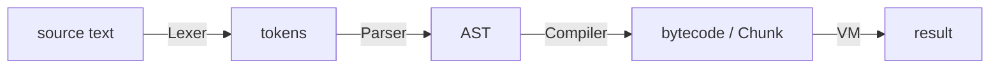
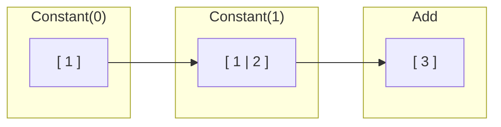
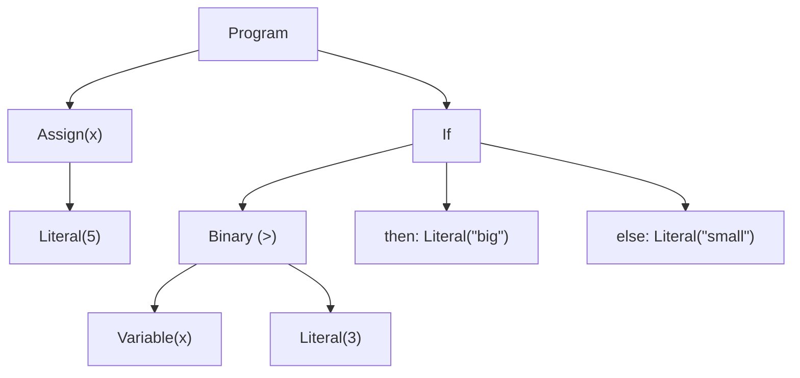
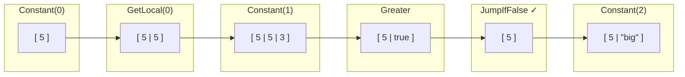
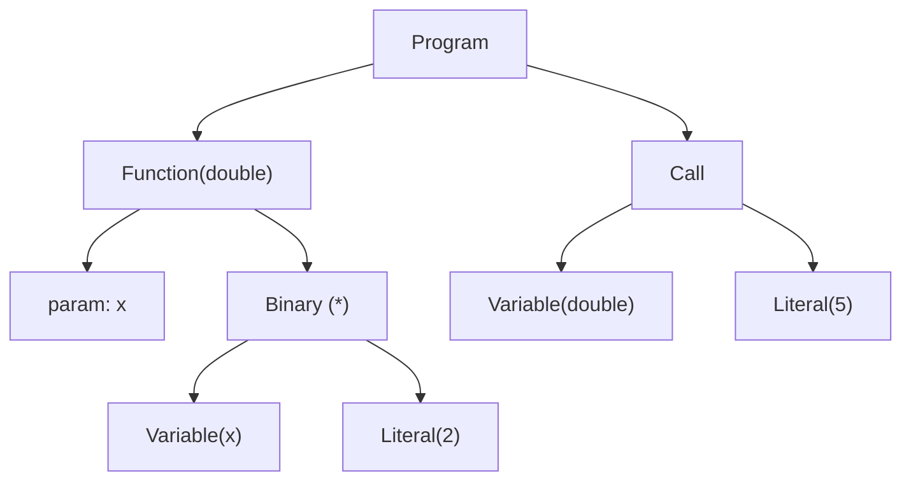
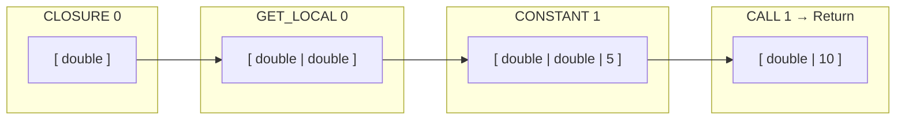

# Bytecode Walkthrough

This document traces three small programs through the Sapphire pipeline, progressively introducing new concepts. Each program goes through the same four stages:



**Pipeline files:** `src/lexer.rs`, `src/token.rs`, `src/parser.rs`, `src/ast.rs`, `src/compiler.rs`, `src/chunk.rs`, `src/vm.rs`, `src/native.rs`

---

## Program 1: `1 + 2`

A minimal example: no variables, no calls, no objects.

### Lexer

`Lexer::scan_tokens` walks the source character-by-character and emits a `Vec<Token>`. Each `Token` carries a `TokenKind`, a line number, and a column.

| `TokenKind`   | Source text |
|---------------|-------------|
| `Number(1)`   | `1`         |
| `Plus`        | `+`         |
| `Number(2)`   | `2`         |
| `Eof`         |             |

Integer scanning happens in `Lexer::number`. When the lexer sees a digit, it collects consecutive digits (skipping `_` separators), then calls `s.parse::<i64>()` and wraps the result in `TokenKind::Number(i64)`. `+` matches the `'+'` arm in `scan_tokens` and becomes `TokenKind::Plus`.

> **Newline insertion:** `Lexer::ends_statement` decides whether a newline should become a `Newline` token (statement terminator). `Number(_)` is in that list, so if the source were `1\n+ 2`, the newline after `1` would produce a `Newline` token and break parsing. On a single line there are no newlines to insert.

### Parser

The parser is a recursive-descent Pratt-style parser. Operator precedence is encoded in the call chain:

```
expression → assignment → or → and → equality → comparison → shift → addition → term → factor → unary → call → primary
```

1. The call chain descends to `Parser::term`, which calls `factor` for the left-hand side.
2. `factor` descends to `unary` → `call` → `primary`.
3. `Parser::primary` sees `TokenKind::Number(1)`, advances, and returns `Expr::Literal(Value::Int(1))`.
4. Back in `term`, the parser checks for `Plus` or `Minus`. It sees `Plus`, advances, and calls `factor` again for the right-hand side.
5. That produces `Expr::Literal(Value::Int(2))`.
6. `term` wraps both sides into `Expr::Binary(Plus, Literal(1), Literal(2))`.

### Compiler

The compiler walks the AST and emits `OpCode`s into a `Chunk`. A `Chunk` is a flat list of `OpCode`s paired with a constant pool (`Vec<Constant>`).

`Expr::Binary` is handled in `Compiler::compile_node`. For non-short-circuit operators, the pattern is: compile left, compile right, emit the operator opcode. Each `Expr::Literal` adds a constant to the pool and emits `OpCode::Constant(index)`. `TokenKind::Plus` maps to `OpCode::Add`.

```
0000     1  CONSTANT          0  (1)
0001     |  CONSTANT          1  (2)
0002     |  Add
0003     |  Return
```

Reading this: `CONSTANT 0` pushes constant-pool entry 0 (the integer `1`), `CONSTANT 1` pushes entry 1 (the integer `2`), `Add` pops both and pushes the sum, `Return` ends execution.

### VM

The VM is a stack machine. Its main loop is `Vm::run_inner`, which reads opcodes one by one and dispatches on them.

`Constant(n)` looks up the constant, converts it to a `VmValue`, and pushes it. `Add` pops two values, calls `numeric_binop` (native.rs), and pushes the result.



Result: `3`.

---

## Program 2: if/else

Adds local variables, comparison, and control flow.

```sapphire
x = 5
if x > 3 { "big" } else { "small" }
```

### Parser

The program produces two top-level expressions: an assignment and an if-expression.

**`x = 5`** : In `Parser::primary`, when the parser sees `Identifier("x")` followed by `Eq`, it consumes both and parses the right-hand side, producing `Expr::Assign { name: "x", value: Literal(Int(5)) }`.

**`if x > 3 { "big" } else { "small" }`** : `Parser::statement_inner` detects `TokenKind::If` and calls `Parser::if_expr`:

1. Parses the condition via the precedence chain. `Parser::comparison` sees `Greater` between two primaries.
2. Calls `Parser::block` for the `{...}` then-branch.
3. Sees `Else`, advances, calls `block` again for the else-branch.



### Compiler

**`x = 5`** : `Expr::Assign` in `Compiler::compile_node`: compiles the value, then pushes a `LocalInfo { name: "x" }` to the compiler's locals list. There is no explicit "DefineLocal" opcode; the value simply stays on the stack at the slot position (slot 0).

**`if x > 3 { ... } else { ... }`** : `Expr::If` in `Compiler::compile_node`: compiles the condition, emits a `JumpIfFalse` with a placeholder offset, compiles the then-branch, emits a `Jump` to skip the else-branch, then compiles the else-branch. After both branches are emitted, it patches the jump offsets.

```
0000     0  CONSTANT          0  (5)       # x = 5
0001     2  GET_LOCAL         0            # push x
0002     |  CONSTANT          1  (3)       # push 3
0003     |  Greater                        # x > 3
0004     |  JUMP_IF_FALSE     2            # false? skip to 0007
0005     |  CONSTANT          2  ("big")   # then-branch
0006     |  JUMP              1            # skip else → 0008
0007     |  CONSTANT          3  ("small") # else-branch
0008     |  Return
```

`JUMP_IF_FALSE 2` at position 4 skips 2 instructions (positions 5–6), landing at 7 (the else-branch). `JUMP 1` at position 6 skips 1 instruction (position 7), landing after the if-expression. These offsets are back-patched by `Chunk::patch_jump` after both branches are emitted.

### VM

Local variables live directly on the stack; slot 0 is `x`.

- **`Constant(0)`** : pushes `VmValue::Int(5)`. This value stays at stack slot 0 as the local `x`.
- **`GetLocal(0)`** : copies `stack[base + 0]` and pushes it. Stack: `[5, 5]`.
- **`Constant(1)`** : pushes `VmValue::Int(3)`. Stack: `[5, 5, 3]`.
- **`Greater`** : pops two values, calls `numeric_cmp` (native.rs) with `|x, y| x > y`. `5 > 3` is `true`. Stack: `[5, true]`.
- **`JumpIfFalse(2)`** : pops `true`. Not falsy, so the IP is *not* adjusted, so execution falls through to the then-branch.
- **`Constant(2)`** : pushes `VmValue::Str("big")`. Stack: `[5, "big"]`.
- **`Jump(1)`** : unconditionally skips the else-branch.



Result: `"big"`. The local `x` remains at the bottom of the stack.

---

## Program 3: functions

Adds function definition and calling.

```sapphire
def double(x) { x * 2 }
double(5)
```

### Parser

The program produces two top-level expressions: a function definition and a call.

**`def double(x) { x * 2 }`** : `Parser::statement_inner` detects `TokenKind::Def` and calls `Parser::function_def`:

1. Consumes the function name (`double`).
2. Parses the parameter list inside `(...)`, yielding one `ParamDef { name: "x" }`.
3. Calls `Parser::block` for the body `{ x * 2 }`.

```rust
Expr::Function {
    name: "double",
    params: [ParamDef { name: "x" }],
    body: [Expr::Binary(Star, Variable("x"), Literal(Int(2)))],
}
```

**`double(5)`** : In `Parser::call`, after `primary` returns `Expr::Variable("double")`, the parser sees `LeftParen` and collects arguments:

```rust
Expr::Call {
    callee: Box::new(Expr::Variable("double")),
    args: [Expr::Literal(Value::Int(5))],
}
```



### Compiler

`Expr::Function` in `Compiler::compile_node` creates a **nested compilation context** via `push_fn`. The body of `double` is compiled into its own `Chunk`, which is then wrapped in a `Constant::Function` and stored in the outer chunk's constant pool.

Inside the nested context, the compiler sets up locals: slot 0 is the function itself (enabling direct recursion by name), slot 1 is the parameter `x`.

**Inner chunk (function `double`):**

```
0000     1  GET_LOCAL         1            # push x (slot 1)
0001     |  CONSTANT          0  (2)       # push 2
0002     |  Mul                            # x * 2
0003     |  Return
```

`Expr::Call` on a variable compiles the callee (`GET_LOCAL` for `double`), then each argument, then emits `OpCode::Call(arg_count)`.

**Outer chunk (top-level):**

```
0000     0  CLOSURE           0  (<fn double>)  # define double, push to slot 0
0001     |  GET_LOCAL         0                  # push double (the callee)
0002     |  CONSTANT          1  (5)             # push argument
0003     |  CALL                   1             # call with 1 arg
0004     |  Return
```

The function definition emits `CLOSURE` (not `CONSTANT`) because all functions are wrapped as closures, even when they capture no upvalues. The closure value stays on the stack at slot 0.

### VM

**Top-level execution:**

- **`CLOSURE 0`** : wraps the `Function` from constant 0 into a `VmValue::Closure` and pushes it. It stays at stack slot 0 as the local `double`.
- **`GET_LOCAL 0`** : copies the closure onto the stack top. Stack: `[double, double]`.
- **`CONSTANT 1`** : pushes `VmValue::Int(5)`. Stack: `[double, double, 5]`.
- **`CALL 1`** : pops the callee and creates a new `CallFrame`. The argument (`5`) remains on the stack as the new frame's locals.

**Inside `double(5)`:** the new call frame starts with locals: slot 0 = the closure itself, slot 1 = `5` (the argument `x`).

- **`GET_LOCAL 1`** : pushes `5`. Stack: `[..., 5]`.
- **`CONSTANT 0`** : pushes `2`. Stack: `[..., 5, 2]`.
- **`Mul`** : pops both, calls `numeric_binop` (native.rs), pushes `10`. Stack: `[..., 10]`.
- **`Return`** : pops the call frame, pushes the return value onto the caller's stack.



Result: `10`.
